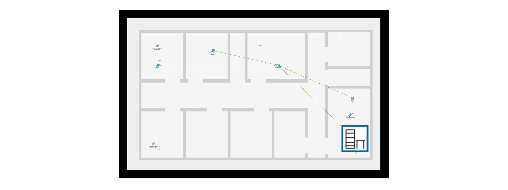
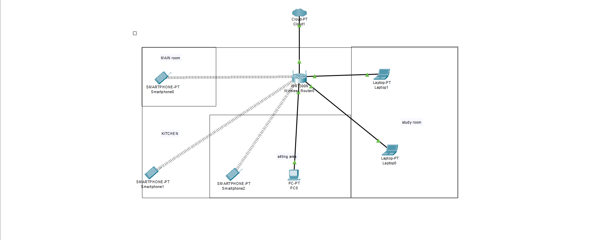

# Home Network Documentation

## 1. Physical Topology

### **Network Overview:**
- **Location:** Home
- **Rooms:** Main Room, Kitchen, Sitting Area, Study Room

### **Devices and Locations:**
| Device         | Room           | Type          | Connection Type    | Interface Names    |
|----------------|----------------|---------------|---------------------|---------------------|
| Wireless Router | Central Location | AP/Router     | Wired/Wireless     | LAN1, LAN2, WAN     |
| Laptop0         | Study Room     | Laptop        | Wireless           | Wi-Fi Interface     |
| Laptop1         | Study Room     | Laptop        | Wireless           | Wi-Fi Interface     |
| PC0             | Sitting Area   | Desktop PC    | Wired (Ethernet)   | Ethernet0           |
| Smartphone0     | Main Room      | Smartphone    | Wireless           | Wi-Fi Interface     |
| Smartphone1     | Kitchen        | Smartphone    | Wireless           | Wi-Fi Interface     |
| Smartphone2     | Sitting Area   | Smartphone    | Wireless           | Wi-Fi Interface     |
| Cloud1          | Internet       | ISP Cloud     | WAN Connection     | Public IP           |

### **Cable Details:**
- **Router to PC0:** Ethernet Cable (LAN1 to Ethernet0)
- **Router to Internet:** WAN port connected to ISP modem
- **Wireless:** Smartphones and laptops connected via Wi-Fi

### **Physical Topology Image:**


---

## 2. Logical Topology

### **Network Diagram:**
- Internet → Wireless Router → Connected Devices (Laptops, PC, Smartphones)
- IP addressing scheme applied for each device

### **Subnets and IP Ranges:**
| Subnet           | Network Address | Range               | Devices               |
|-----------------|-----------------|---------------------|-----------------------|
| Main LAN         | 192.168.1.0/24  | 192.168.1.1 - .254  | Laptops, PC, Phones   |
| Gateway (Router) | 192.168.1.1     |                      | Router's LAN IP       |

### **Logical Topology Image:**


---

## 3. Addressing Documentation

### **IP Address Assignments:**
| Device          | IP Address       | Subnet Mask      | Default Gateway     |
|----------------|------------------|------------------|---------------------|
| Router LAN     | 192.168.1.1      | 255.255.255.0    | N/A                 |
| Laptop0        | 192.168.1.10     | 255.255.255.0    | 192.168.1.1         |
| Laptop1        | 192.168.1.11     | 255.255.255.0    | 192.168.1.1         |
| PC0            | 192.168.1.20     | 255.255.255.0    | 192.168.1.1         |
| Smartphone0    | 192.168.1.30     | 255.255.255.0    | 192.168.1.1         |
| Smartphone1    | 192.168.1.31     | 255.255.255.0    | 192.168.1.1         |
| Smartphone2    | 192.168.1.32     | 255.255.255.0    | 192.168.1.1         |

---

## 4. Device Details

### **Router:**
- **Model:** WRT300N
- **Firmware:** v2.0.5
- **Interfaces:** LAN1, LAN2, WAN
- **Wireless Bands:** 2.4 GHz
- **Security:** WPA2-PSK with AES encryption

### **PC:**
- **OS:** Windows 10
- **NIC:** Intel Ethernet Adapter
- **Connection:** Wired

### **Laptops:**
- **OS:** Windows 10
- **NIC:** Wireless Adapter
- **Connection:** Wireless

### **Smartphones:**
- **OS:** Android/iOS
- **Connection:** Wireless

---

## 5. Configuration Documentation

### **Router Configuration:**
- **SSID:** HomeNetwork
- **Password:** WPA2-secure-password
- **DHCP:** Enabled (192.168.1.10 – 192.168.1.100)
- **Port Forwarding:** Disabled
- **Firewall:** Enabled with basic filtering

### **PC Configuration:**
- **Static IP:** 192.168.1.20
- **Subnet:** 255.255.255.0
- **Gateway:** 192.168.1.1

---

## 6. Credential Storage Method

### **Credential Storage:**
- **Method:** Encrypted password manager (e.g., Bitwarden, KeePass)
- **Backup:** Secure offline backup in encrypted file
- **Access control:** Only accessible by authorized family members

---

✅ **End of Documentation**
```

